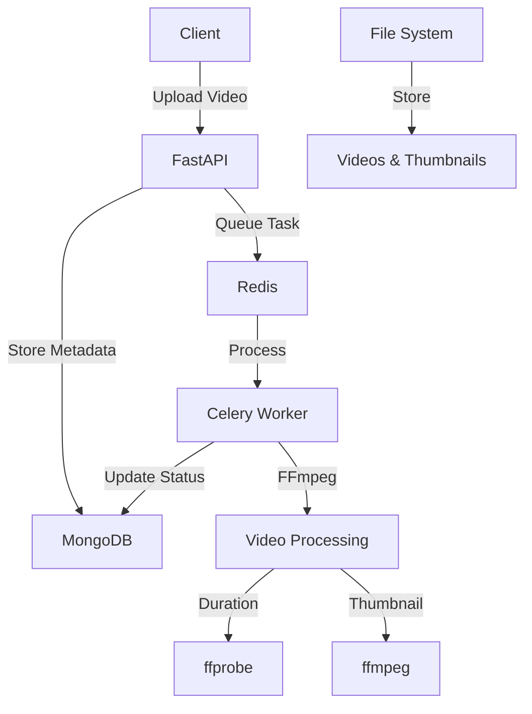

# Clipo

# 🎬 Clipo AI Backend Assignment


[](https://fastapi.tiangolo.com/)
[](https://www.mongodb.com/)
[](https://docs.celeryproject.org/)
[](https://redis.io/)
[](https://ffmpeg.org/)

Contents

- [Overview](#-overview)
- [Tech Stack](#-tech-stack)
- [Features](#-features)
- [Setup Instructions](#-setup-instructions)
  - [GitHub Codespaces (Recommended)](#-github-codespaces-recommended)
  - [Local Development](#-local-development)
- [API Documentation](#-api-documentation)
- [Sample API Requests](#-sample-api-requests)
- [FFmpeg Commands](#-ffmpeg-commands)
- [Architecture](#-architecture)
- [Testing](#-testing)

## 🎯 Overview

Clipo AI Backend is a production-ready video processing API that handles video uploads, extracts metadata, and generates thumbnails using FFmpeg. The system uses Celery for background processing and MongoDB for data persistence.

### Key Capabilities
- **Async Video Upload** with file validation
- **Background Processing** using Celery workers
- **Duration Extraction** using FFmpeg's ffprobe
- **Thumbnail Generation** at 10% of video duration
- **Real-time Status Tracking** (pending → processing → done)
- **RESTful API** with comprehensive error handling

## 🛠 Tech Stack

| Component | Technology | Purpose |
|-----------|------------|---------|
| **Web Framework** | FastAPI | Async API with automatic documentation |
| **Database** | MongoDB (pymongo) | Document storage for video metadata |
| **Task Queue** | Celery + Redis | Background video processing |
| **Video Processing** | FFmpeg | Duration extraction and thumbnail generation |
| **Containerization** | Docker | Service orchestration and deployment |

## ✨ Features

- 🎥 **Multi-format Video Support** (MP4, AVI, MOV, MKV, WMV, FLV, WebM)
- 📊 **Real-time Processing Status** tracking
- 🖼️ **Automatic Thumbnail Generation** at optimal timing
- 📏 **Video Duration Extraction** with precise timing
- 🔒 **File Validation** and size limits (100MB)
- 📚 **Interactive API Documentation** with Swagger UI
- 🐳 **Docker Ready** for easy deployment
- ⚡ **Async Processing** for high performance

## 🚀 Setup Instructions

### 🌟 GitHub Codespaces (Recommended)

**Perfect for quick testing without local setup!**

#### Step 1: Launch Codespace
```bash
# 1. Fork/Clone this repository
# 2. Click "Code" → "Create codespace on main"
# 3. Wait for environment setup (2-3 minutes)
```

#### Step 2: Install Dependencies
```bash
# Install FFmpeg and Python dependencies
sudo apt update && sudo apt install -y ffmpeg
pip install -r requirements.txt
```

#### Step 3: Start Services
```bash
# Start MongoDB and Redis
docker-compose up -d mongodb redis

# Start Celery worker
celery -A main.celery_app worker --loglevel=info &

# Start FastAPI application
uvicorn main:app --host 0.0.0.0 --port 8000 --reload
```

#### Step 4: Access Your API
- **API Docs**: `https://your-codespace-url/docs`
- **Health Check**: `https://your-codespace-url/health`

### 💻 Local Development

#### Prerequisites
- Python 3.9+
- Docker & Docker Compose
- FFmpeg

#### Step 1: Clone Repository
```bash
git clone https://github.com/yourusername/clipo-ai-backend.git
cd clipo-ai-backend
```

#### Step 2: Install FFmpeg

**macOS:**
```bash
brew install ffmpeg
```

**Ubuntu/Debian:**
```bash
sudo apt update && sudo apt install -y ffmpeg
```

**Windows:**
```bash
# Download from https://ffmpeg.org/download.html
# Add to PATH environment variable
```

#### Step 3: Setup Python Environment
```bash
# Create virtual environment
python -m venv venv
source venv/bin/activate  # On Windows: venv\Scripts\activate

# Install dependencies
pip install -r requirements.txt
```

#### Step 4: Start Services
```bash
# Start MongoDB and Redis
docker-compose up -d mongodb redis

# Start Celery worker
celery -A main.celery_app worker --loglevel=info &

# Start FastAPI application
uvicorn main:app --host 0.0.0.0 --port 8000 --reload
```

#### Step 5: Verify Installation
```bash
# Check services
curl http://localhost:8000/health

# Expected response:
# {"status":"healthy","message":"Clipo AI Backend is running"}
```

## 📚 API Documentation

### Endpoints Overview

| Method | Endpoint | Description | Status Codes |
|--------|----------|-------------|--------------|
| `GET` | `/health` | Health check | 200 |
| `POST` | `/upload-video/` | Upload video file | 202, 400, 413, 500 |
| `GET` | `/video-status/{id}` | Get processing status | 200, 404, 400 |
| `GET` | `/video-metadata/{id}` | Get complete metadata | 200, 404, 400 |
| `GET` | `/docs` | Interactive API docs | 200 |

### Response Models

#### Upload Response
```json
{
  "id": "507f1f77bcf86cd799439011",
  "filename": "sample_video.mp4",
  "upload_time": "2025-06-17T12:01:00.000Z",
  "status": "pending",
  "message": "Video uploaded successfully. Processing started."
}
```

#### Status Response
```json
{
  "id": "507f1f77bcf86cd799439011",
  "status": "done"
}
```

#### Metadata Response
```json
{
  "filename": "sample_video.mp4",
  "upload_time": "2025-06-17T12:01:00.000Z",
  "status": "done",
  "duration": "00:00:30",
  "thumbnail_url": "https://your-domain/thumbnails/sample_video_thumb.jpg",
  "file_size": 5242880,
  "error_message": null
}
```

## 🧪 Sample API Requests

### Using cURL

#### 1. Health Check
```bash
curl -X GET "http://localhost:8000/health"
```

#### 2. Create Test Video
```bash
# Generate a 10-second test video
ffmpeg -f lavfi -i testsrc=duration=10:size=320x240:rate=1 -pix_fmt yuv420p test_video.mp4
```

#### 3. Upload Video
```bash
curl -X POST "http://localhost:8000/upload-video/" \
  -F "file=@test_video.mp4" \
  -H "Content-Type: multipart/form-data"
```

**Response:**
```json
{
  "id": "507f1f77bcf86cd799439011",
  "filename": "test_video.mp4",
  "upload_time": "2025-06-17T12:01:00.000Z",
  "status": "pending",
  "message": "Video uploaded successfully. Processing started."
}
```

#### 4. Check Processing Status
```bash
# Replace {video_id} with actual ID from upload response
curl -X GET "http://localhost:8000/video-status/507f1f77bcf86cd799439011"
```

**Response:**
```json
{
  "id": "507f1f77bcf86cd799439011",
  "status": "processing"
}
```

#### 5. Get Complete Metadata
```bash
curl -X GET "http://localhost:8000/video-metadata/507f1f77bcf86cd799439011"
```

**Response:**
```json
{
  "filename": "test_video.mp4",
  "upload_time": "2025-06-17T12:01:00.000Z",
  "status": "done",
  "duration": "00:00:10",
  "thumbnail_url": "http://localhost:8000/thumbnails/test_video_thumb.jpg",
  "file_size": 1048576,
  "error_message": null
}
```

### Using Postman

#### Collection Setup
1. **Create New Collection**: "Clipo AI Backend"
2. **Set Base URL**: `{{base_url}}` = `http://localhost:8000`
3. **Import requests** using the cURL commands above

#### Environment Variables
```json
{
  "base_url": "http://localhost:8000",
  "video_id": "507f1f77bcf86cd799439011"
}
```

### Using Python Requests
```python
import requests
import json

# Base URL
BASE_URL = "http://localhost:8000"

# 1. Health Check
response = requests.get(f"{BASE_URL}/health")
print("Health:", response.json())

# 2. Upload Video
with open("test_video.mp4", "rb") as f:
    files = {"file": ("test_video.mp4", f, "video/mp4")}
    response = requests.post(f"{BASE_URL}/upload-video/", files=files)
    upload_result = response.json()
    video_id = upload_result["id"]
    print("Upload:", upload_result)

# 3. Check Status
response = requests.get(f"{BASE_URL}/video-status/{video_id}")
print("Status:", response.json())

# 4. Get Metadata
response = requests.get(f"{BASE_URL}/video-metadata/{video_id}")
print("Metadata:", response.json())
```

## ⚙️ FFmpeg Commands

The application uses these specific FFmpeg commands for video processing:

### Duration Extraction
```bash
ffprobe -v quiet -print_format json -show_format {video_file}
```

**Purpose**: Extract video duration and format information
**Output**: JSON with duration in seconds
**Example**:
```json
{
  "format": {
    "duration": "30.000000",
    "size": "1048576",
    "format_name": "mov,mp4,m4a,3gp,3g2,mj2"
  }
}
```

### Thumbnail Generation
```bash
ffmpeg -i {video_file} -ss {timestamp} -vframes 1 -q:v 2 -s 320x240 -y {output_file}
```

**Parameters Explained**:
- `-i {video_file}`: Input video file
- `-ss {timestamp}`: Seek to specific time (10% of duration)
- `-vframes 1`: Extract exactly one frame
- `-q:v 2`: High quality (scale 1-31, lower = better)
- `-s 320x240`: Output resolution
- `-y`: Overwrite output file if exists

**Example Command**:
```bash
ffmpeg -i sample_video.mp4 -ss 3.0 -vframes 1 -q:v 2 -s 320x240 -y sample_video_thumb.jpg
```

### Test Video Creation
```bash
ffmpeg -f lavfi -i testsrc=duration=10:size=320x240:rate=1 -pix_fmt yuv420p test_video.mp4
```

**Parameters**:
- `-f lavfi`: Use libavfilter virtual input
- `-i testsrc`: Generate test pattern
- `duration=10`: 10 seconds long
- `size=320x240`: Resolution
- `rate=1`: 1 FPS
- `-pix_fmt yuv420p`: Pixel format for compatibility

## 🏗 Architecture



### Component Responsibilities

| Component | Responsibility |
|-----------|----------------|
| **FastAPI** | HTTP API, request validation, response formatting |
| **MongoDB** | Video metadata storage, status tracking |
| **Redis** | Task queue, result backend |
| **Celery** | Background task processing, retry logic |
| **FFmpeg** | Video analysis, thumbnail generation |

### Processing Flow

1. **Upload** → Client uploads video via POST /upload-video/
2. **Validation** → File type, size, and format validation
3. **Storage** → Save file to disk, metadata to MongoDB
4. **Queue** → Enqueue processing task in Redis
5. **Process** → Celery worker extracts duration and generates thumbnail
6. **Update** → Update MongoDB with results
7. **Complete** → Client can fetch metadata with thumbnail URL

## 🧪 Testing

### Automated Testing
```bash
# Run test suite
pytest tests/ -v

# Run with coverage
pytest tests/ --cov=app --cov-report=html
```

### Manual Testing Checklist

- [ ] Health endpoint responds correctly
- [ ] Video upload accepts valid formats
- [ ] Video upload rejects invalid formats
- [ ] File size validation works (100MB limit)
- [ ] Background processing starts after upload
- [ ] Status updates correctly (pending → processing → done)
- [ ] Duration extraction is accurate
- [ ] Thumbnail generation works at 10% duration
- [ ] Thumbnail URL is accessible
- [ ] Error handling for corrupted files
- [ ] MongoDB connection resilience
- [ ] Redis connection resilience

### Performance Testing
```bash
# Load testing with multiple uploads
for i in {1..10}; do
  curl -X POST "http://localhost:8000/upload-video/" \
    -F "file=@test_video.mp4" &
done
wait
```

## 🐳 Docker Deployment

### Production Docker Compose
```yaml
version: '3.8'
services:
  web:
    build: .
    ports:
      - "8000:8000"
    environment:
      - MONGODB_URL=mongodb://mongodb:27017
      - REDIS_URL=redis://redis:6379/0
    depends_on:
      - mongodb
      - redis
      
  celery-worker:
    build: .
    command: celery -A main.celery_app worker --loglevel=info
    depends_on:
      - mongodb
      - redis
      
  mongodb:
    image: mongo:7.0
    volumes:
      - mongodb_data:/data/db
      
  redis:
    image: redis:7.2-alpine
    volumes:
      - redis_data:/data

volumes:
  mongodb_data:
  redis_data:
```

### Deployment Commands
```bash
# Build and start all services
docker-compose up --build -d

# Scale workers
docker-compose up --scale celery-worker=3 -d

# View logs
docker-compose logs -f web celery-worker
```

## 🤝 Contributing

1. Fork the repository
2. Create a feature branch (`git checkout -b feature/amazing-feature`)
3. Commit your changes (`git commit -m 'Add amazing feature'`)
4. Push to the branch (`git push origin feature/amazing-feature`)
5. Open a Pull Request


## 🙏 Acknowledgments

- [FastAPI](https://fastapi.tiangolo.com/) for the excellent async web framework
- [FFmpeg](https://ffmpeg.org/) for powerful video processing capabilities
- [Celery](https://docs.celeryproject.org/) for reliable background task processing
- [MongoDB](https://www.mongodb.com/) for flexible document storage

---


**Built with ❤️ for the Clipo AI Backend Assignment**

[](https://github.com/Amit-0905/Clipo/stargazers)
[](https://github.com/Amit-0905/Clipo/network/members)
